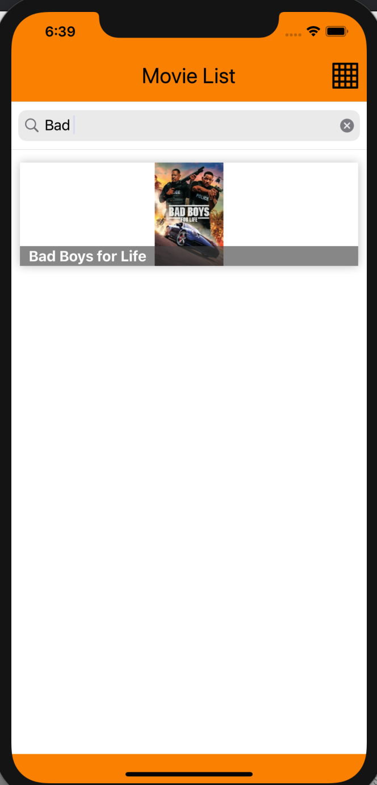

# Movies List (IOS Application)

It offers features like listing popular movies, searching and adding favorites.

## Info

- VIPER architecture used
- We have 2 pages.(HomePage And MovieDetailPage)
- App settings are available in the App Files folder.
- Inside the Api Service folder, there are Service requests.
- There are existing screens in the application in the Arenas folder.
- Inside the Viper Core folder there are settings for the Viper architecture.

## ScreenShots

